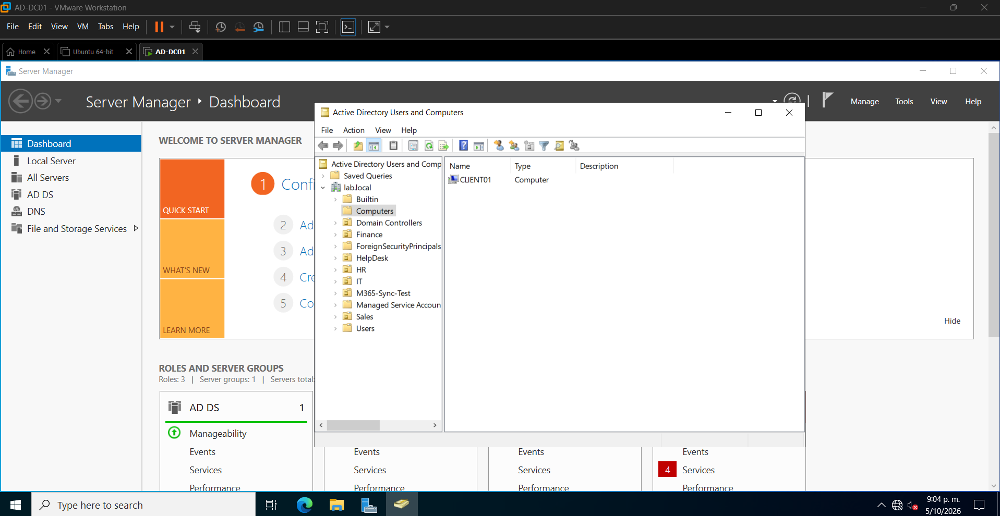
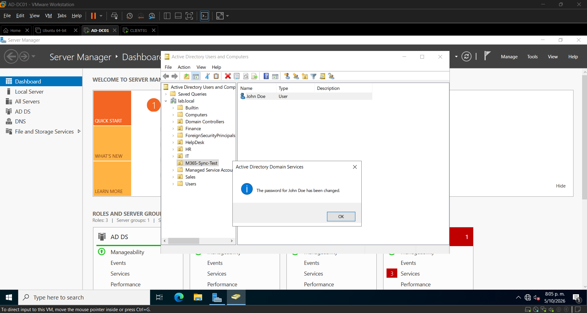
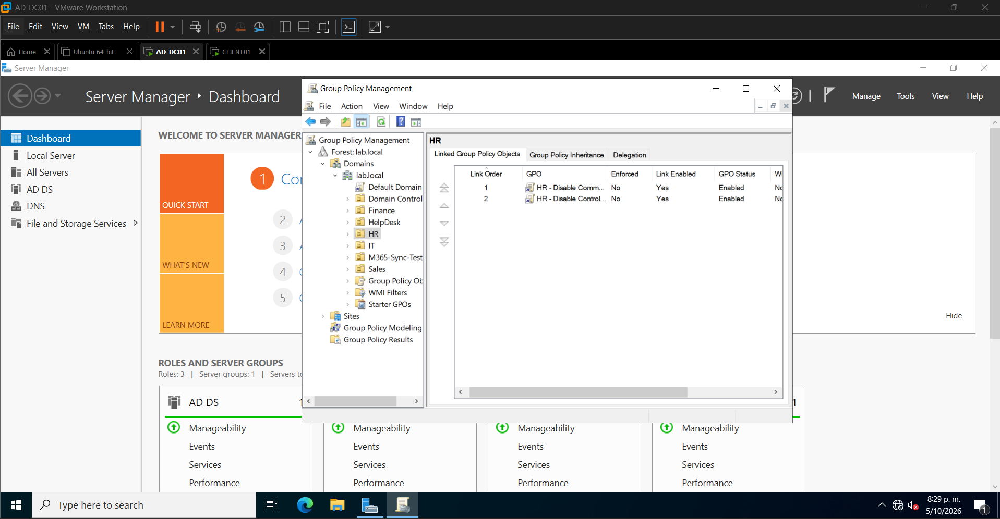
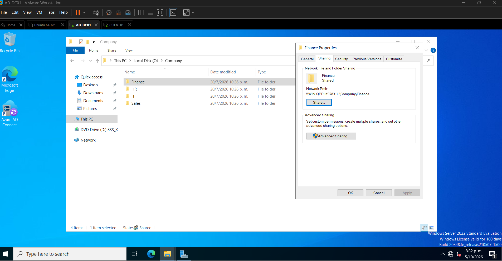
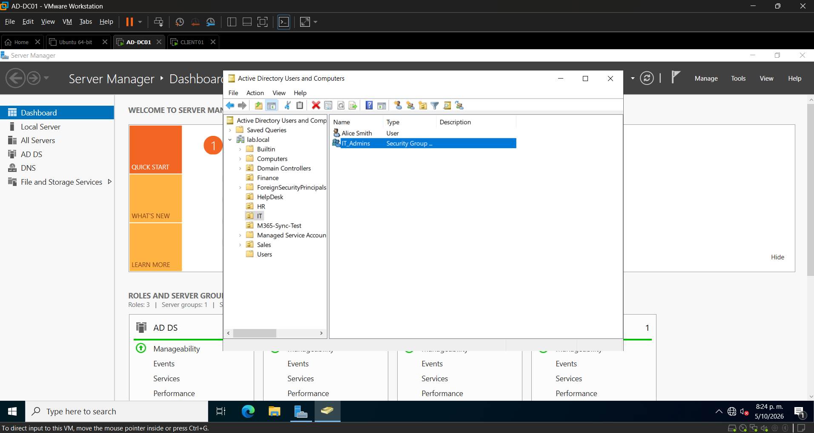
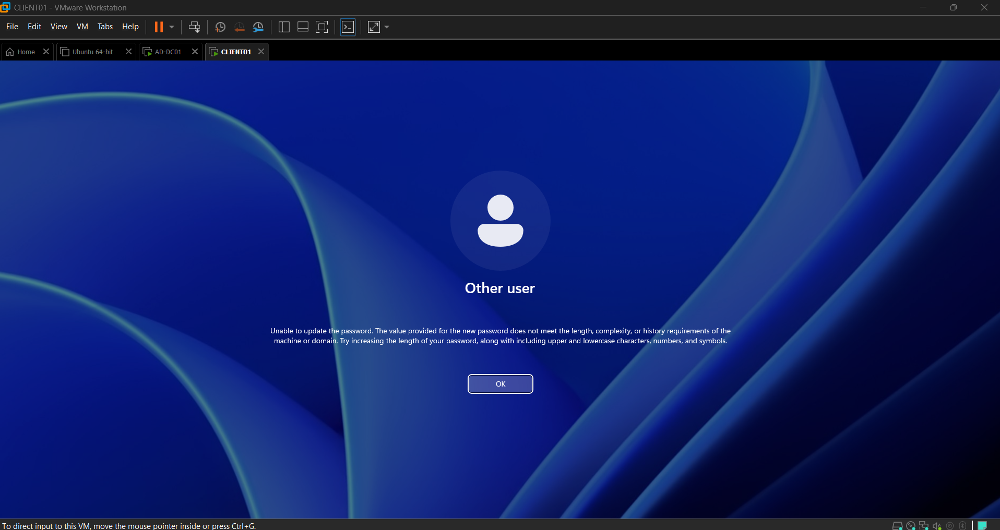
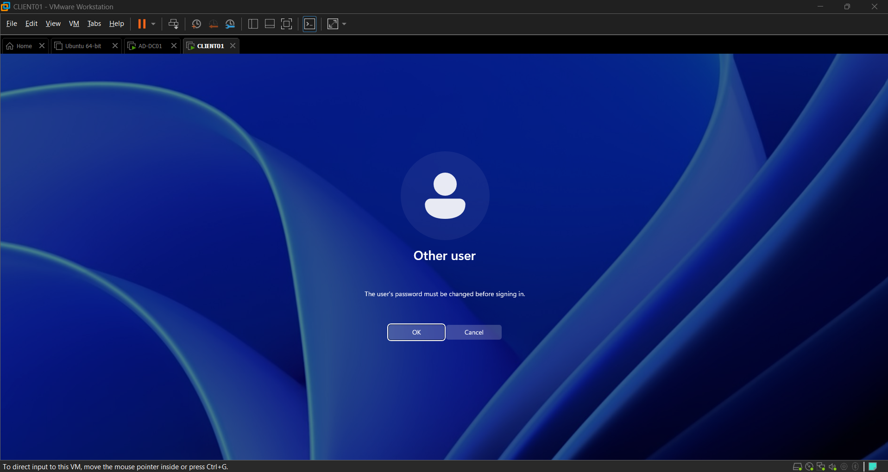
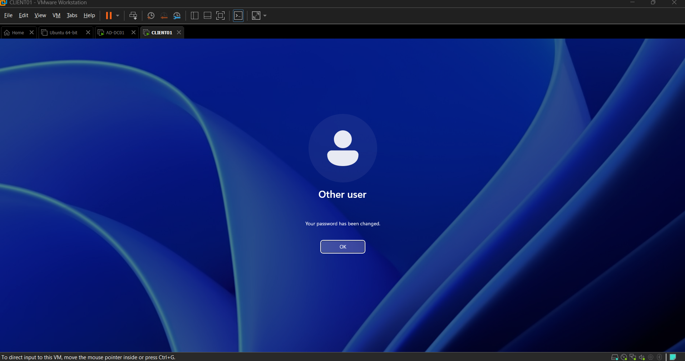

# Active Directory Home Lab

Hands-on Active Directory home lab built using Windows Server and VMware Workstation. This project demonstrates practical experience with Windows Server administration, Active Directory, user and computer management, Group Policy, file sharing, security groups, and password management.

## Lab Environment

- **Hypervisor:** VMware Workstation
- **Server OS:** Windows Server
- **Directory Service:** Active Directory Domain Services (AD DS)
- **Domain:** lab.local
- **Domain Controller:** AD-DC01
- **Client:** CLIENT01

## Skills Demonstrated

- Active Directory administration
- User account management
- Computer account management
- Organizational Unit (OU) management
- Security group management
- Group Policy configuration
- Password policy configuration
- File sharing and permissions
- Domain user password reset
- User password changes
- Windows Server administration
- Basic Windows Server troubleshooting

## Lab Tasks

### 1. Active Directory Computer Management

Managed domain-joined computers through Active Directory Users and Computers.

### 2. Active Directory User Management

Created and managed domain user accounts and organized users within appropriate OUs.

### 3. Group Policy Management

Configured and managed Group Policy settings for the Active Directory environment.

### 4. File Sharing Configuration

Configured Windows file sharing and permissions for controlled access to shared resources.

### 5. Security Group Management

Created and managed security groups to control access to resources.

### 6. Password Policy Configuration

Configured password policy requirements to improve account security.

### 7. Domain User Password Reset

Performed a password reset for a domain user through Active Directory.

### 8. Password Change Verification

Verified successful password changes for a domain account.

## What I Learned

Through this lab, I gained hands-on experience administering a Windows Server Active Directory environment. I practiced managing users, computers, groups, policies, permissions, and authentication while troubleshooting common administrative tasks.

## Project Goal

The goal of this lab is to build practical Windows Server and Active Directory administration skills relevant to **IT Support, Service Desk, System Administration, and Cybersecurity** roles.
